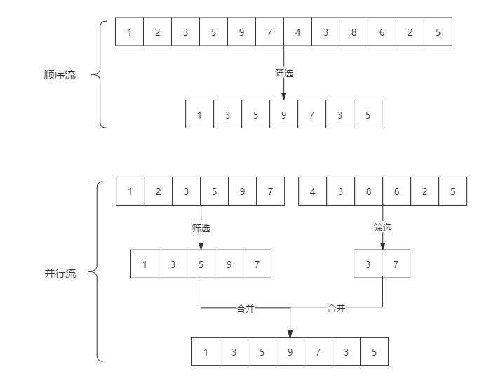
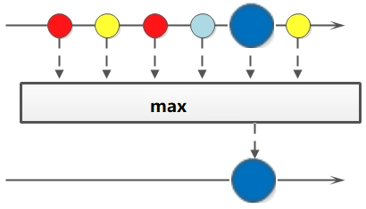

# Java8 Stream

参考: https://blog.csdn.net/mu_wind/article/details/109516995

## 1 .Stream概述

Java8 是一个非常成功的版本,这个版本新增的Stream, 配合同版本出现的Lambda,给我们操作集合(Collection)提供了极大的便利

### Stream 是什么

```txt
Stream 可以由数组或集合创建,Stream将要处理的元素集合看作一种流，在流的过程中，借助Stream API对流中的元素进行操作，比如：筛选、排序、聚合等
```

### Sream对流的操作

1.中间操作,每次返回一个新的流,可以有多个

2.终端操作,每个流只能进行一次终端操作,终端操作结束后流无法再次使用. 终端操作会产生一个新的集合或值.

### Stream的特性

1.Stream不存储数据,二十按照特定的规则对数据进行计算,一般会输出结果.

2.Stream不会改变数据源,通常情况下回产生一个新的集合或一个值..

3.Stream具有延迟执行特性,只有调用终端操作时,中间操作才会执行

## 2.Stream的创建

### Stream可以通过集合或数据创建

1.通过 java.util.Collection.stream() 方法用集合创建流

```java
        List<String> list = Arrays.asList("a", "b", "c");
        // 创建一个顺序流
        Stream<String> stream = list.stream();
        // 创建一个并行流
        Stream<String> parallelStream = list.parallelStream();
```

2.使用java.util.Arrays.stream(T[] array)方法用数组创建流


```java
        int [] array = {1,2,3,4,5,6,7,8};
        IntStream stream = Arrays.stream(array);
```

3使用Stream的静态方法：of()、iterate()、generate()

```java
        Stream<Integer> stream = Stream.of(1, 2, 3, 4, 5, 6);

        Stream<Integer> stream1 = Stream.iterate(0, (x) -> x + 3).limit(4);
        stream1.forEach(System.out::println);

        Stream<Double> stream2 = Stream.generate(Math::random).limit(3);
        stream2.forEach(System.out::println);
```

stream和parallelStream的简单区分：stream是顺序流,由逐渐成按顺序对流执行操作,而parallelStream是并行流,内部以多线程并行执行的方式对流进行操作,但前提是对流中的数据处理没有顺序要求. 例如筛选集合中的奇数,两者的处理不同之处:



如果流中的数据量足够大,并行刘可以加快处理速度.

除了直接创建并行流,还可以通过parallel()把顺序流转换成并行流：

```java
    List<Integer> list = Arrays.asList(1, 3, 5, 7, 9, 11, 13);
        Optional<Integer> findFirst = list.stream().parallel().filter(x -> x > 6).findFirst();
```


## 3.Stream的使用

- 在使用stream之前,先理解一个概念: Optional

  Optional类是一个可以为null的容器对象. 如果值存在isPresent()方法会返回true,调用get()方法会返回该对象

  更详细说明请见: 菜鸟教程Java8 

  [Optional类]: https://www.runoob.com/java/java8-optional-class.html

**接下来，大批代码向你袭来！我将用20个案例将Stream的使用整得明明白白，只要跟着敲一遍代码，就能很好地掌握。**


### 案例使用的员工类

```java
@Data
public class Person {

    private String name; // 姓名
    private int salary; // 薪资
    private int age;   //年龄
    private String sex; // 性别
    private String area; //区域

    public Person(String name, int salary, String sex, String area) {
        this.name = name;
        this.salary = salary;
        this.sex = sex;
        this.area = area;
    }

    public static List<Person> getPersonList() {
        List<Person> personList = new ArrayList<Person>();
        personList.add(new Person("Tom", 8900, "male", "New York"));
        personList.add(new Person("Jack", 7000, "male", "Washington"));
        personList.add(new Person("Lily", 7800, "female", "Washington"));
        personList.add(new Person("Anni", 8200, "female", "New York"));
        personList.add(new Person("Owen", 9500, "male", "New York"));
        personList.add(new Person("Alisa", 7900, "female", "New York"));
        return personList;
    }
}
```

### 3.1   遍历/匹配(foreach/find/match)

Stream 也是支持类似集合的遍历和匹配与匹配元素的,只是Stream中的元素是以Optional类型存在的.

Stream的遍历/匹配非常简单


```java
public class StreamMatchTest {

    public static void main(String[] args) {
        List<Integer> list = Arrays.asList(7, 6, 9, 3, 8, 2, 1);

        // 遍历输出符合条件的元素
        list.stream().filter(x -> x > 3).forEach(System.out::println);
        // 匹配第一个元素
        Optional<Integer> first = list.stream().filter(x -> x > 6).findFirst();
        // 匹配任意(适用于并行流)
        Optional<Integer> findAny = list.parallelStream().filter(x -> x > 6).findAny();
        // 是否包含符合特定条件的元素
        boolean flag = list.stream().anyMatch(x -> x < 6);

        System.out.println("匹配第一个值：" + first.orElse(0));
        System.out.println("匹配第一个值：" + findAny.orElse(0));
        System.out.println("是否存在大于6的值：" + flag);
    }
}
```

### 3.2 筛选(filter)

筛选是按照一定的规则校验流中的元素,将符合条件的元素提取到新的流中的操作


**案例01: 筛选出Integer集合中大于7的元素,并打印出来**

```java
    @Test
    public void test01(){
        List<Integer> list = Arrays.asList(6, 7, 3, 8, 1, 2, 9);
        Stream<Integer> stream = list.stream();
        stream.filter(a ->a >7).forEach(System.out :: println);
    }
```

输出结果

```java
8
9
```

**案例02: 筛选员工中工资高于8000的人，并形成新的集合。 形成新集合依赖collect（收集），后文有详细介绍**

```java
    @Test
    public void test02() {
        List<Person> personList = Person.getPersonList();
        List<String> filterList = personList.stream().filter(x -> x.getSalary() > 8000).map(Person::getName).collect(Collectors.toList());
        System.out.print("高于8000的员工姓名：" + filterList);
    }
```

```
高于8000的员工姓名：[Tom, Anni, Owen]
```

### 3.3  聚合（max/min/count)

max、min、count这些字眼你一定不陌生，没错，在mysql中我们常用它们进行数据统计。Java stream中也引入了这些概念和用法，极大地方便了我们对集合、数组的数据统计工作。



**案例01: 获取String集合中最长的元素**

```java
   @Test
    public void test01() {
        List<String> list = Arrays.asList("adnm", "admmt", "pot", "xbangd", "weoujgsd");
        Optional<String> max = list.stream().max(Comparator.comparing(String::length));
        System.out.println("最长的字符串：" + max.get());
    }
```

```
最长的字符串：weoujgsd
```


**案例02: 获取Integer集合中的最大值**


```java
    @Test
    public void test02() {
        List<Integer> list = Arrays.asList(7, 6, 9, 4, 11, 6);
        // 自然排序
        Optional<Integer> max = list.stream().max(Integer::compareTo);
        // 自定义排序
        Optional<Integer> max1 = list.stream().max(new Comparator<Integer>() {
            @Override
            public int compare(Integer o1, Integer o2) {
                return o1.compareTo(o2);
            }
        });
        System.out.println("自然排序的最大值：" + max.get());
        System.out.println("自定义排序的最大值：" + max1.get());
    }
```

```
自然排序的最大值：11
自定义排序的最大值：11
```

 **案例03: 获取员工工资最高的人**

```java
    @Test
    public void test03() {
        List<Person> personList = Person.getPersonList();
        Optional<Person> max = personList.stream().max(Comparator.comparingInt(Person::getSalary));
        System.out.println("员工工资最大值：" + max.get().getSalary());
    }
```

```
员工工资最大值：9500
```

**案例04：计算`Integer`集合中大于6的元素的个数**

```java
    @Test
    public void test04() {
        List<Integer> list = Arrays.asList(7, 6, 4, 8, 2, 11, 9);
        long count = list.stream().filter(x -> x > 6).count();
        System.out.println("list中大于6的元素个数：" + count);
    }
```

```
list中大于6的元素个数：4
```

### 3.4  映射(map/flatMap)

映射,可以将一个流的元素按照一定的映射规则到另一个流中.分为map和flatMap;

- map: 接受一个函数作为参数,该函数会被应用到每个元素上,并将其映射成一个新的元素
- flatMap:  接受一个函数作为参数,将流中的每个值都换成另一个流,然后所有流连接成一个流


**案例一：英文字符串数组的元素全部改为大写。整数数组每个元素+3**

```java
    @Test
    public void test01(){
        String[] strArr = { "abcd", "bcdd", "defde", "fTr" };
        List<String> strList = Arrays.stream(strArr).map(String::toUpperCase).collect(Collectors.toList());

        List<Integer> intList = Arrays.asList(1, 3, 5, 7, 9, 11);
        List<Integer> intListNew  = intList.stream().map(x -> x + 3).collect(Collectors.toList());

        System.out.println("每个元素大写：" + strList);
        System.out.println("每个元素+3：" + intListNew);
    }
```

```
每个元素大写：[ABCD, BCDD, DEFDE, FTR]
每个元素+3：[4, 6, 8, 10, 12, 14]
```

