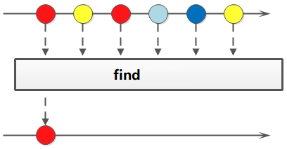

# Java8 Stream

参考: https://blog.csdn.net/mu_wind/article/details/109516995

## 1 .Stream概述

Java8 是一个非常成功的版本,这个版本新增的Stream, 配合同版本出现的Lambda,给我们操作集合(Collection)提供了极大的便利

### Stream 是什么

```txt
Stream 可以由数组或集合创建,Stream将要处理的元素集合看作一种流，在流的过程中，借助Stream API对流中的元素进行操作，比如：筛选、排序、聚合等
```

### Sream对流的操作

1.中间操作,每次返回一个新的流,可以有多个

2.终端操作,每个流只能进行一次终端操作,终端操作结束后流无法再次使用. 终端操作会产生一个新的集合或值.

### Stream的特性

1.Stream不存储数据,二十按照特定的规则对数据进行计算,一般会输出结果.

2.Stream不会改变数据源,通常情况下回产生一个新的集合或一个值..

3.Stream具有延迟执行特性,只有调用终端操作时,中间操作才会执行

## 2.Stream的创建

### Stream可以通过集合或数据创建

1.通过 java.util.Collection.stream() 方法用集合创建流

```java
        List<String> list = Arrays.asList("a", "b", "c");
        // 创建一个顺序流
        Stream<String> stream = list.stream();
        // 创建一个并行流
        Stream<String> parallelStream = list.parallelStream();
```

2.使用java.util.Arrays.stream(T[] array)方法用数组创建流


```java
        int [] array = {1,2,3,4,5,6,7,8};
        IntStream stream = Arrays.stream(array);
```

3使用Stream的静态方法：of()、iterate()、generate()

```java
        Stream<Integer> stream = Stream.of(1, 2, 3, 4, 5, 6);

        Stream<Integer> stream1 = Stream.iterate(0, (x) -> x + 3).limit(4);
        stream1.forEach(System.out::println);

        Stream<Double> stream2 = Stream.generate(Math::random).limit(3);
        stream2.forEach(System.out::println);
```

stream和parallelStream的简单区分：stream是顺序流,由逐渐成按顺序对流执行操作,而parallelStream是并行流,内部以多线程并行执行的方式对流进行操作,但前提是对流中的数据处理没有顺序要求. 例如筛选集合中的奇数,两者的处理不同之处:


如果流中的数据量足够大,并行刘可以加快处理速度.

除了直接创建并行流,还可以通过parallel()把顺序流转换成并行流：

```java
    List<Integer> list = Arrays.asList(1, 3, 5, 7, 9, 11, 13);
        Optional<Integer> findFirst = list.stream().parallel().filter(x -> x > 6).findFirst();
```


## 3.Stream的使用

- 在使用stream之前,先理解一个概念: Optional

  Optional类是一个可以为null的容器对象. 如果值存在isPresent()方法会返回true,调用get()方法会返回该对象

  更详细说明请见: 菜鸟教程Java8 

  [Optional类]: https://www.runoob.com/java/java8-optional-class.html

**接下来，大批代码向你袭来！我将用20个案例将Stream的使用整得明明白白，只要跟着敲一遍代码，就能很好地掌握。**


### 案例使用的员工类

```java
@Data
public class Person {

    private String name; // 姓名
    private int salary; // 薪资
    private int age;   //年龄
    private String sex; // 性别
    private String area; //区域

    public Person(String name, int salary, String sex, String area) {
        this.name = name;
        this.salary = salary;
        this.sex = sex;
        this.area = area;
    }

    public static List<Person> getPersonList() {
        List<Person> personList = new ArrayList<Person>();
        personList.add(new Person("Tom", 8900, "male", "New York"));
        personList.add(new Person("Jack", 7000, "male", "Washington"));
        personList.add(new Person("Lily", 7800, "female", "Washington"));
        personList.add(new Person("Anni", 8200, "female", "New York"));
        personList.add(new Person("Owen", 9500, "male", "New York"));
        personList.add(new Person("Alisa", 7900, "female", "New York"));
        return personList;
    }
}
```

### 3.1   遍历/匹配(foreach/find/match)

Stream 也是支持类似集合的遍历和匹配与匹配元素的,只是Stream中的元素是以Optional类型存在的.

Stream的遍历/匹配非常简单



```java
public class StreamMatchTest {

    public static void main(String[] args) {
        List<Integer> list = Arrays.asList(7, 6, 9, 3, 8, 2, 1);

        // 遍历输出符合条件的元素
        list.stream().filter(x -> x > 3).forEach(System.out::println);
        // 匹配第一个元素
        Optional<Integer> first = list.stream().filter(x -> x > 6).findFirst();
        // 匹配任意(适用于并行流)
        Optional<Integer> findAny = list.parallelStream().filter(x -> x > 6).findAny();
        // 是否包含符合特定条件的元素
        boolean flag = list.stream().anyMatch(x -> x < 6);

        System.out.println("匹配第一个值：" + first.orElse(0));
        System.out.println("匹配第一个值：" + findAny.orElse(0));
        System.out.println("是否存在大于6的值：" + flag);
    }
}
```

### 3.2 筛选(filter)

筛选是按照一定的规则校验流中的元素,将符合条件的元素提取到新的流中的操作


**案例01: 筛选出Integer集合中大于7的元素,并打印出来**

```java
    @Test
    public void test01(){
        List<Integer> list = Arrays.asList(6, 7, 3, 8, 1, 2, 9);
        Stream<Integer> stream = list.stream();
        stream.filter(a ->a >7).forEach(System.out :: println);
    }
```

输出结果

```java
8
9
```

**案例02: 筛选员工中工资高于8000的人，并形成新的集合。 形成新集合依赖collect（收集），后文有详细介绍**

```java
    @Test
    public void test02() {
        List<Person> personList = Person.getPersonList();
        List<String> filterList = personList.stream().filter(x -> x.getSalary() > 8000).map(Person::getName).collect(Collectors.toList());
        System.out.print("高于8000的员工姓名：" + filterList);
    }
```

```
高于8000的员工姓名：[Tom, Anni, Owen]
```

### 3.3  聚合（max/min/count)

max、min、count这些字眼你一定不陌生，没错，在mysql中我们常用它们进行数据统计。Java stream中也引入了这些概念和用法，极大地方便了我们对集合、数组的数据统计工作。


**案例01: 获取String集合中最长的元素**

```java
   @Test
    public void test01() {
        List<String> list = Arrays.asList("adnm", "admmt", "pot", "xbangd", "weoujgsd");
        Optional<String> max = list.stream().max(Comparator.comparing(String::length));
        System.out.println("最长的字符串：" + max.get());
    }
```

```
最长的字符串：weoujgsd
```


**案例02: 获取Integer集合中的最大值**


```java
    @Test
    public void test02() {
        List<Integer> list = Arrays.asList(7, 6, 9, 4, 11, 6);
        // 自然排序
        Optional<Integer> max = list.stream().max(Integer::compareTo);
        // 自定义排序
        Optional<Integer> max1 = list.stream().max(new Comparator<Integer>() {
            @Override
            public int compare(Integer o1, Integer o2) {
                return o1.compareTo(o2);
            }
        });
        System.out.println("自然排序的最大值：" + max.get());
        System.out.println("自定义排序的最大值：" + max1.get());
    }
```

```
自然排序的最大值：11
自定义排序的最大值：11
```

 **案例03: 获取员工工资最高的人**

```java
    @Test
    public void test03() {
        List<Person> personList = Person.getPersonList();
        Optional<Person> max = personList.stream().max(Comparator.comparingInt(Person::getSalary));
        System.out.println("员工工资最大值：" + max.get().getSalary());
    }
```

```
员工工资最大值：9500
```

**案例04：计算`Integer`集合中大于6的元素的个数**

```java
    @Test
    public void test04() {
        List<Integer> list = Arrays.asList(7, 6, 4, 8, 2, 11, 9);
        long count = list.stream().filter(x -> x > 6).count();
        System.out.println("list中大于6的元素个数：" + count);
    }
```

```
list中大于6的元素个数：4
```

### 3.4  映射(map/flatMap)

映射,可以将一个流的元素按照一定的映射规则到另一个流中.分为map和flatMap;

- map: 接受一个函数作为参数,该函数会被应用到每个元素上,并将其映射成一个新的元素
- flatMap:  接受一个函数作为参数,将流中的每个值都换成另一个流,然后所有流连接成一个流


**案例一：英文字符串数组的元素全部改为大写。整数数组每个元素+3**

```java
    @Test
    public void test01(){
        String[] strArr = { "abcd", "bcdd", "defde", "fTr" };
        List<String> strList = Arrays.stream(strArr).map(String::toUpperCase).collect(Collectors.toList());

        List<Integer> intList = Arrays.asList(1, 3, 5, 7, 9, 11);
        List<Integer> intListNew  = intList.stream().map(x -> x + 3).collect(Collectors.toList());

        System.out.println("每个元素大写：" + strList);
        System.out.println("每个元素+3：" + intListNew);
    }
```

```
每个元素大写：[ABCD, BCDD, DEFDE, FTR]
每个元素+3：[4, 6, 8, 10, 12, 14]
```

**案例二：将员工的薪资全部增加1000。**

```java
    @Test
    public void test02() {
        List<Person> personList = Person.getPersonList();
        // 不改变原来员工集合的方式
        List<Person> personListNew = personList.stream().map(person -> {
            Person personNew = new Person(person.getName(), 0, 0, null, null);
            personNew.setSalary(person.getSalary() + 1000);
            return personNew;
        }).collect(Collectors.toList());
        System.out.println("一次改动前：" + personList.get(0).getName() + "-->" + personList.get(0).getSalary());
        System.out.println("一次改动后：" + personListNew.get(0).getName() + "-->" + personListNew.get(0).getSalary());

        // 改变原来员工集合的方式
        List<Person> personListNew2 = personList.stream().map(person -> {
            person.setSalary(person.getSalary() + 1000);
            return person;
        }).collect(Collectors.toList());

        System.out.println("二次改动前：" + personList.get(0).getName() + "-->" + personListNew.get(0).getSalary());
        System.out.println("二次改动后：" + personListNew2.get(0).getName() + "-->" + personListNew.get(0).getSalary());
    }
```

```
一次改动前：Tom-->8900
一次改动后：Tom-->9900
二次改动前：Tom-->9900
二次改动后：Tom-->9900
```

**案例三：将两个字符数组合并成一个新的字符数组。**

```java
    @Test
    public void test03() {
        List<String> list = Arrays.asList("m,k,l,a", "1,3,5,7");
        List<String> listNew = list.stream().flatMap(s -> {
            // 将每个元素转换成一个stream
            String[] split = s.split(",");
            return Arrays.stream(split);
        }).collect(Collectors.toList());

        System.out.println("处理前的集合：" + list);
        System.out.println("处理后的集合：" + listNew);
    }
```

```
处理前的集合：[m,k,l,a, 1,3,5,7]
处理后的集合：[m, k, l, a, 1, 3, 5, 7]
```

### 3.5  归约(reduce)

归约,也称缩减,顾名思义,是把一个流缩减成一个值,能实现对集合求和,求乘积和求最值操作


**案例一：求`Integer`集合的元素之和、乘积和最大值。**

```java
    @Test
    public void test01() {
        List<Integer> list = Arrays.asList(1, 3, 2, 8, 11, 4);
        // 求和方式1
        Optional<Integer> sum = list.stream().reduce((x, y) -> x + y);
        // 求和方式2
        Optional<Integer> sum2 = list.stream().reduce(Integer::sum);
        // 求和方式3
        Integer sum3 = list.stream().reduce(0, Integer::sum);
        // 求乘积
        Optional<Integer> product = list.stream().reduce((x, y) -> x * y);
        // 求最大值方式1
        Optional<Integer> max = list.stream().reduce((x, y) -> x > y ? x : y);
        // 求最大值方式2
        Integer max2 = list.stream().reduce(1, Integer::max);
        System.out.println("list求和：" + sum.get() + "," + sum2.get() + "," + sum3);
        System.out.println("list求积：" + product.get());
        System.out.println("list求最大值：" + max.get() + "," + max2);
    }
```

```
list求和：29,29,29
list求积：2112
list求和：11,11
```

**案例二：求所有员工的工资之和和最高工资。**

```java
    @Test
    public void test02() {
        List<Person> personList = Person.getPersonList();
        // 求工资之和方式1
        Optional<Integer> sumSalary = personList.stream().map(Person::getSalary).reduce(Integer::sum);
        // 求工资之和方式2
        Integer sumSalary2 = personList.stream().reduce(0, (sum, p) -> sum += p.getSalary(), (sum1, sum2) -> sum1 + sum2);
        // 求工资之和方式3
        Integer sumSalary3 = personList.stream().reduce(0, (sum, p) -> sum += p.getSalary(), Integer::sum);
        // 求最高工资方式1
        Integer maxSalary = personList.stream().reduce(0, (max, p) -> max > p.getSalary() ? max : p.getSalary(), Integer::max);
        // 求最高工资方式2
        Integer maxSalary2 = personList.stream().reduce(0, (max, p) -> max > p.getSalary() ? max : p.getSalary(), (a, b) -> a > b ? a : b);
        System.out.println("工资之和：" + sumSalary.get() + "," + sumSalary2 + "," + sumSalary3);
        System.out.println("最高工资：" + maxSalary + "," + maxSalary2);
    }
```

```
工资之和：49300,49300,49300
最高工资：9500,9500
```

### 3.6 收集(Collect)

案例演示`toList`、`toSet`和 toMap

```java
 @Test
    public void test01() {
         /**
         * 因为流不存储数据，那么在流中的数据完成处理后，
         * 需要将流中的数据重新归集到新的集合里。
         * toList、toSet和toMap比较常用，
         * 另外还有toCollection、toConcurrentMap等复杂一些的用法
         **/
        List<Integer> list = Arrays.asList(1, 6, 3, 4, 6, 7, 9, 6, 20);
        List<Integer> listNew = list.stream().filter(x -> x % 2 == 0).collect(Collectors.toList());
        Set<Integer> set = list.stream().filter(x -> x % 2 == 0).collect(Collectors.toSet());

        List<Person> personList = Person.getPersonList();
        Map<?, Integer> map = personList.stream().filter(p -> p.getSalary() > 8000).collect(Collectors.toMap(Person::getName, Person::getSalary));
        Map<?, Person> map1 = personList.stream().filter(p -> p.getSalary() > 8000).collect(Collectors.toMap(Person::getName, p -> p));

        System.out.println("toList:" + listNew);
        System.out.println("toSet:" + set);
        System.out.println("toMap:" + map);
        System.out.println("toMap:" + map1);
```

```
toList:[6, 4, 6, 6, 20]
toSet:[4, 20, 6]
toMap:{Tom=8900, Owen=9500, Anni=8200}
toMap:{Tom=Person(name=Tom, salary=8900, age=0, sex=male, area=New York), Owen=Person(name=Owen, salary=9500, age=0, sex=male, area=New York), Anni=Person(name=Anni, salary=8200, age=0, sex=female, area=New York)}
```

统计(count/averaging)

- 计数：count
- 平均值：averagingInt、averagingLong、averagingDouble
- 最值：maxBy、minBy
- 求和：summingInt、summingLong、summingDouble
- 统计以上所有：summarizingInt、summarizingLong、summarizingDouble

**案例：统计员工人数、平均工资、工资总额、最高工资。**

```java
@Test
    public void test02() {
        List<Person> personList = Person.getPersonList();
        // 求总数
        Long count = personList.stream().collect(Collectors.counting());
//        Long count = personList.stream().count();
        // 求平均工资
        Double average = personList.stream().collect(Collectors.averagingDouble(Person::getSalary));
        // 求最高工资
        Optional<Integer> max = personList.stream().map(Person::getSalary).collect(Collectors.maxBy(Integer::compare));
        // 求工资之和
        IntSummaryStatistics sum = personList.stream().collect(Collectors.summarizingInt(Person::getSalary));
        // 一次性统计所有信息
        DoubleSummaryStatistics collect = personList.stream().collect(Collectors.summarizingDouble(Person::getSalary));

        System.out.println("员工总数：" + count);
        System.out.println("员工平均工资：" + average);
        System.out.println("员工最高工资：" + max.get());
        System.out.println("员工工资总和：" + sum);
        System.out.println("员工工资所有统计：" + collect);
    }
```

```
员工总数：6
员工平均工资：8216.666666666666
员工最高工资：9500
员工工资总和：IntSummaryStatistics{count=6, sum=49300, min=7000, average=8216.666667, max=9500}
员工工资所有统计：DoubleSummaryStatistics{count=6, sum=49300.000000, min=7000.000000, average=8216.666667, max=9500.000000}
```


分组(partitioningBy/groupingBy)

- 分区：将`stream`按条件分为两个`Map`，比如员工按薪资是否高于8000分为两部分。

- 分组：将集合分为多个Map，比如员工按性别分组。有单级分组和多级分组。

  

案例：将员工按薪资是否高于8000分为两部分；将员工按性别和地区分组

```java
/**
     * 分组(partitioningBy/groupingBy)
     * <p>
     * 分区：将stream按条件分为两个Map，比如员工按薪资是否高于8000分为两部分。
     * 分组：将集合分为多个Map，比如员工按性别分组。有单级分组和多级分组。
     * <p>
     * 案例：将员工按薪资是否高于8000分为两部分；将员工按性别和地区分组
     **/
    @Test
    public void test03() {
        List<Person> personList = Person.getPersonList();

        // 将员工按薪资是否高于8000分组
        Map<Boolean, List<Person>> part = personList.stream().collect(Collectors.partitioningBy(x -> x.getSalary() > 8000));
        // 将员工按性别分组
        Map<String, List<Person>> group = personList.stream().collect(Collectors.groupingBy(Person::getSex));
        // 将员工先按性别分组，再按地区分组
        Map<String, Map<String, List<Person>>> group2 = personList.stream().collect(Collectors.groupingBy(Person::getSex, Collectors.groupingBy(Person::getArea)));

        System.out.println("员工按薪资是否大于8000分组情况：" + part);
        System.out.println("员工按性别分组情况：" + group);
        System.out.println("员工按性别、地区：" + group2);
        System.out.println("员工按性别、地区：" + JSON.toJSONString(group2));
    }
```

```
员工按薪资是否大于8000分组情况：{false=[Person(name=Jack, salary=7000, age=0, sex=male, area=Washington), Person(name=Lily, salary=7800, age=0, sex=female, area=Washington), Person(name=Alisa, salary=7900, age=0, sex=female, area=New York)], true=[Person(name=Tom, salary=8900, age=0, sex=male, area=New York), Person(name=Anni, salary=8200, age=0, sex=female, area=New York), Person(name=Owen, salary=9500, age=0, sex=male, area=New York)]}
员工按性别分组情况：{female=[Person(name=Lily, salary=7800, age=0, sex=female, area=Washington), Person(name=Anni, salary=8200, age=0, sex=female, area=New York), Person(name=Alisa, salary=7900, age=0, sex=female, area=New York)], male=[Person(name=Tom, salary=8900, age=0, sex=male, area=New York), Person(name=Jack, salary=7000, age=0, sex=male, area=Washington), Person(name=Owen, salary=9500, age=0, sex=male, area=New York)]}
员工按性别、地区：{female={New York=[Person(name=Anni, salary=8200, age=0, sex=female, area=New York), Person(name=Alisa, salary=7900, age=0, sex=female, area=New York)], Washington=[Person(name=Lily, salary=7800, age=0, sex=female, area=Washington)]}, male={New York=[Person(name=Tom, salary=8900, age=0, sex=male, area=New York), Person(name=Owen, salary=9500, age=0, sex=male, area=New York)], Washington=[Person(name=Jack, salary=7000, age=0, sex=male, area=Washington)]}}
员工按性别、地区：{"female":{"New York":[{"age":0,"area":"New York","name":"Anni","salary":8200,"sex":"female"},{"age":0,"area":"New York","name":"Alisa","salary":7900,"sex":"female"}],"Washington":[{"age":0,"area":"Washington","name":"Lily","salary":7800,"sex":"female"}]},"male":{"New York":[{"age":0,"area":"New York","name":"Tom","salary":8900,"sex":"male"},{"age":0,"area":"New York","name":"Owen","salary":9500,"sex":"male"}],"Washington":[{"age":0,"area":"Washington","name":"Jack","salary":7000,"sex":"male"}]}}

```

案例: 接合(joining)

```java
/**
     * 接合(joining)
     * <p>
     * joining可以将stream中的元素用特定的连接符（没有的话，则直接连接）连接成一个字符串
     **/
    @Test
    public void test04() {
        List<Person> personList = Person.getPersonList();

        String names = personList.stream().map(p -> p.getName()).collect(Collectors.joining(","));
        System.out.println("所有员工的姓名：" + names);

        List<String> list = Arrays.asList("A", "B", "C");
        String collect = list.stream().collect(Collectors.joining("-"));
        System.out.println("拼接后的字符串：" + collect);
    }
```

```
所有员工的姓名：Tom,Jack,Lily,Anni,Owen,Alisa
拼接后的字符串：A-B-C
```


归约(reducing)

- `Collectors`类提供的`reducing`方法，相比于`stream`本身的`reduce`方法，增加了对自定义归约的支持

```java
/**
     * 归约(reducing)
     *
     * Collectors类提供的reducing方法，相比于stream本身的reduce方法，增加了对自定义归约的支持
     **/
    @Test
    public void test05(){
        List<Person> personList = Person.getPersonList();

        // 每个员工减去起征点后的薪资之和
//        Integer sum = personList.stream().collect(Collectors.reducing(0, Person::getSalary, (i, j) -> (i + j - 5000)));
        Integer sum = personList.stream().map(Person::getSalary).reduce(0, (i, j) -> (i + j - 5000));
        /**
         * 个人理解: 规约操作时 增加了锚点(元素)0,  集合内任意两个元素相加会增加一个-5000的运算,
         * 按道理来说应该会少一次-5000操作,但是因为增加了一个元素0进行操作,所以规避了这个问题
         **/
        System.out.println("员工免税薪资总和：" + sum);

        // stream的reduce
        Optional<Integer> sum2 = personList.stream().map(Person::getSalary).reduce(Integer::sum);
        System.out.println("员工薪资总和：" + sum2.get());
    }
```

```
员工免税薪资总和：19300
员工薪资总和：49300
```

### 3.7排序(sorted)

- sorted()：自然排序，流中元素需实现Comparable接口
- sorted(Comparator com)：Comparator排序器自定义排序

**案例：将员工按工资由高到低（工资一样则按年龄由大到小）排序**

```java
     /**
      * 案例：将员工按工资由高到低（工资一样则按年龄由大到小）排序
     **/
    @Test
    public void test01() {
        List<Person> personList = Person.getPersonList();
        // 按工资升序排序（自然排序）
        List<String> newList = personList.stream().sorted(Comparator.comparing(Person::getSalary)).map(Person::getName).collect(Collectors.toList());
        // 按工资倒序排序
        List<Person> newList2 = personList.stream().sorted(Comparator.comparing(Person::getSalary).reversed()).collect(Collectors.toList());
        // 先按工资再按年龄升序排序
        List<Person> newList3 = personList.stream().sorted(Comparator.comparing(Person::getSalary).thenComparing(Person::getAge)).collect(Collectors.toList());
//        List<String> newList3 = personList.stream().sorted(Comparator.comparing(Person::getSalary).thenComparing(Person::getAge)).map(Person::getName).collect(Collectors.toList());
        // 先按工资再按年龄自定义排序（降序）
        List<Person> newList4 = personList.stream().sorted((p1, p2) -> {
            if (p1.getSalary() == p2.getSalary()) {
                return p2.getAge() - p1.getAge();
            } else {
                return p2.getSalary() - p1.getSalary();
            }
        }).collect(Collectors.toList());

        System.out.println("按工资升序排序：" + newList);
        System.out.println("按工资降序排序：" + newList2);
        System.out.println("先按工资再按年龄升序排序：" + newList3);
        System.out.println("先按工资再按年龄自定义降序排序：" + newList4);
    }
```

```
按工资升序排序：[Jack, Lily, Alisa, Anni, Tom, Owen]
按工资降序排序：[Person(name=Owen, salary=9500, age=0, sex=male, area=New York), Person(name=Tom, salary=8900, age=0, sex=male, area=New York), Person(name=Anni, salary=8200, age=0, sex=female, area=New York), Person(name=Alisa, salary=7900, age=0, sex=female, area=New York), Person(name=Lily, salary=7800, age=0, sex=female, area=Washington), Person(name=Jack, salary=7000, age=0, sex=male, area=Washington)]
先按工资再按年龄升序排序：[Person(name=Jack, salary=7000, age=0, sex=male, area=Washington), Person(name=Lily, salary=7800, age=0, sex=female, area=Washington), Person(name=Alisa, salary=7900, age=0, sex=female, area=New York), Person(name=Anni, salary=8200, age=0, sex=female, area=New York), Person(name=Tom, salary=8900, age=0, sex=male, area=New York), Person(name=Owen, salary=9500, age=0, sex=male, area=New York)]
先按工资再按年龄自定义降序排序：[Person(name=Owen, salary=9500, age=0, sex=male, area=New York), Person(name=Tom, salary=8900, age=0, sex=male, area=New York), Person(name=Anni, salary=8200, age=0, sex=female, area=New York), Person(name=Alisa, salary=7900, age=0, sex=female, area=New York), Person(name=Lily, salary=7800, age=0, sex=female, area=Washington), Person(name=Jack, salary=7000, age=0, sex=male, area=Washington)]

```

### 3.8提取/组合

- 流也可以进行合并、去重、限制、跳过等操作。


```java
 /**
     * 提取/组合
     * 流也可以进行合并、去重、限制、跳过等操作
     **/
    @Test
    public void test02() {
        String[] arr1 = {"a", "b", "c", "d"};
        String[] arr2 = {"d", "e", "f", "g"};

        Stream<String> stream1 = Stream.of(arr1);
        Stream<String> stream2 = Stream.of(arr2);

        // concat:合并两个流  distinct：去重
        List<String> newList = Stream.concat(stream1, stream2).distinct().collect(Collectors.toList());
        // limit:限制从流中获取n个数据
        List<Integer> collect = Stream.iterate(1, x -> x + 2).limit(10).collect(Collectors.toList());
        // skip:跳过前n个数据
        List<Integer> collect2 = Stream.iterate(1, x -> x + 3).skip(1).limit(5).collect(Collectors.toList());
        System.out.println("流合并：" + newList);
        System.out.println("limit：" + collect);
        System.out.println("skip：" + collect2);
    }
```

```
合并流：[a, b, c, d, e, f, g]
limit：[1, 3, 5, 7, 9, 11, 13, 15, 17, 19]
skip：[4, 7, 10, 13, 16]
```

