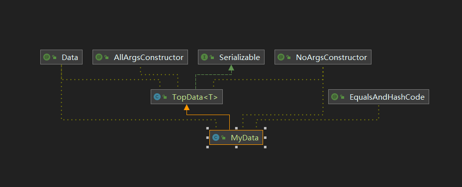

# 数据处理 BeanUtils

## 1.demo01 应用场景

公共参数对象 转换 私有参数对象


若MyData直接继承UpData, 则会报错, 主要是重载时的类型擦除引起

### 解决方式

MyData与UpData为同级数据,同时继承TopData<T>类




同属性字段还可以直接用 BeanUtils.copyProperties(source, target);

```java
public class MainTest {
    public static void main(String[] args) {
        // 获取公共入参
        LinkedList<UpData> upData = getUpData();
        LinkedList<MyData> myData = new LinkedList<>();
        // 转换成 myData
        if (upData.size() > 0) {
            upData.forEach(info -> {
                MyData temp = new MyData();
                BeanUtils.copyProperties(info, temp);
                myData.add(temp);
            });
        }

        int size = myData.size();
        myData.forEach(info -> {
            System.out.println(info.toString());
        });


    }

    public static LinkedList<UpData> getUpData() {
        LinkedList<UpData> upData = new LinkedList<>();
        ArrayList<UpInfo> infos = new ArrayList<>();
        infos.add(new UpInfo("A", 90));
        infos.add(new UpInfo("B", 80));
        upData.add(new UpData("1", infos));

        infos = new ArrayList<>();
        infos.add(new UpInfo("C", 70));
        infos.add(new UpInfo("D", 60));
        upData.add(new UpData("2", infos));
        return upData;
    }
   }
```

